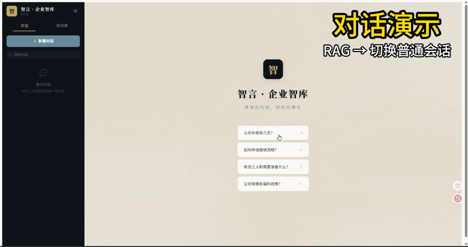
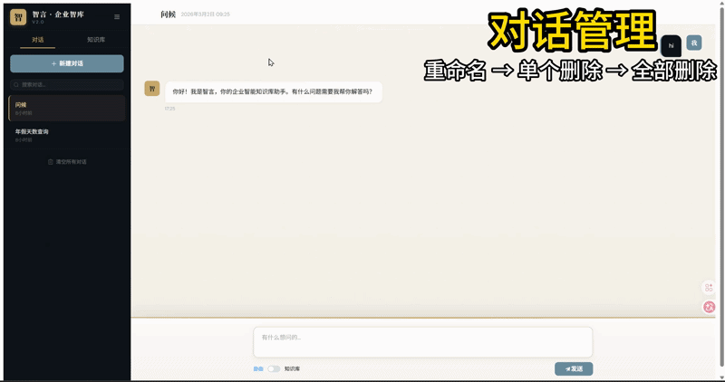
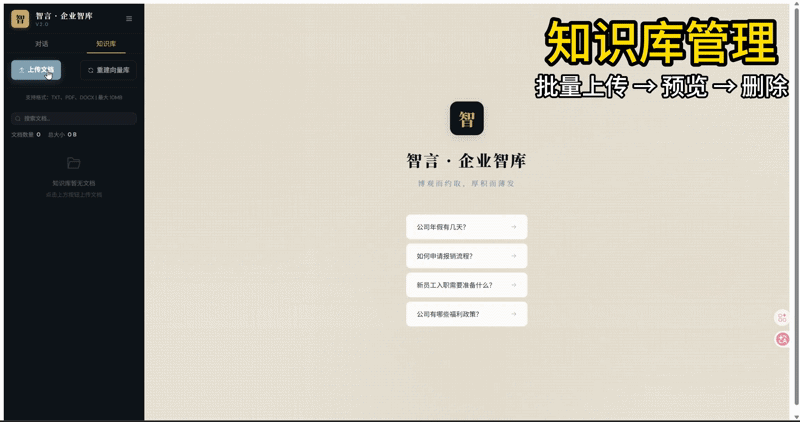
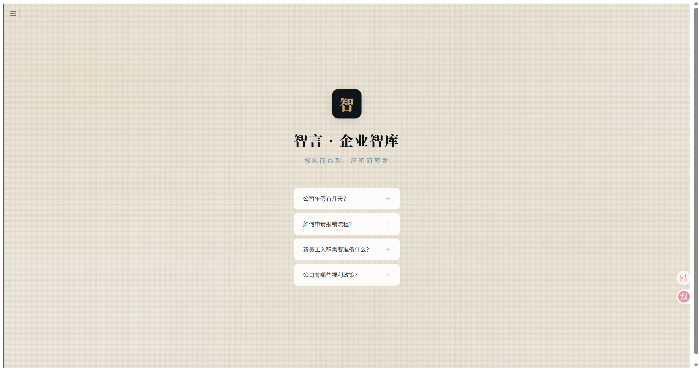
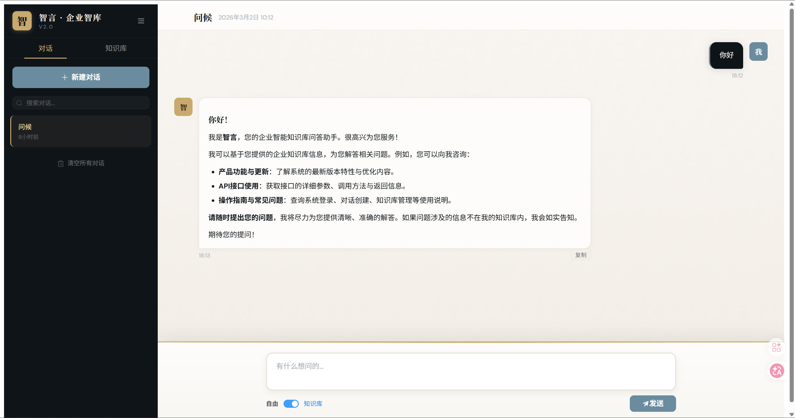
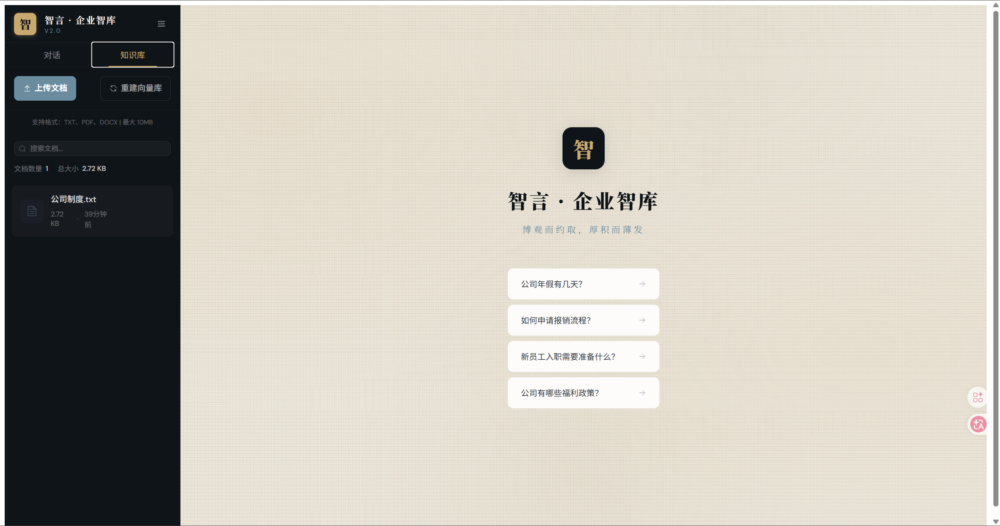

# 智言 · 企业智库

> 基于 DeepSeek API + LangChain + RAG 的企业级智能问答系统

一个现代化的企业知识库问答应用，支持流式响应、多轮对话、RAG 检索增强生成。


---

## 🎯 项目亮点

- **🚀 流式响应** - SSE 实时输出，AI 回答逐字显示
- **📚 RAG 知识库** - 基于 Chroma 向量数据库的智能检索
- **📂 知识库管理** - 支持 PDF/Word/TXT 上传、预览、删除
- **✨ 现代交互** - 精心设计的动效与视觉体验
- **🔍 智能搜索** - 全文检索对话历史，关键词高亮
- **📝 自动标题** - 首条消息自动生成对话标题

---

## 📸 界面预览

### 对话演示



### 对话管理



### 知识库管理



### 界面截图

| 欢迎页 | 聊天界面 | 知识库 |
|:---:|:---:|:---:|
|  |  |  |

---

## 🛠️ 技术栈

### 后端
- **FastAPI** - 高性能异步 Web 框架
- **LangChain** - AI 应用开发框架（LCEL 链式调用）
- **Chroma** - 向量数据库
- **SQLite** - 轻量级数据持久化
- **SSE** - Server-Sent Events 流式传输
- **PyPDF / Docx2txt** - 多格式文档解析

### 前端
- **Vue 3** - Composition API
- **Element Plus** - UI 组件库
- **Vue Router** - 路由管理
- **Vite** - 构建工具

---

## 🚀 快速开始

### 环境要求
- Python 3.10+
- Node.js 18+

### 1. 克隆项目
```bash
git clone https://github.com/your-username/chat-app.git
cd chat-app
```

### 2. 后端配置
```bash
cd backend

# 创建虚拟环境
python -m venv venv
source venv/bin/activate  # Windows: venv\Scripts\activate

# 安装依赖
pip install -r requirements.txt

# 配置 API Key
echo "DEEPSEEK_API_KEY=your-api-key" > .env
```

### 3. 前端配置
```bash
cd frontend
npm install
```

### 4. 启动服务
```bash
# 终端1 - 启动后端
cd backend
uvicorn main:app --reload --port 8000

# 终端2 - 启动前端
cd frontend
npm run dev
```

### 5. 访问应用
- **前端界面**：http://localhost:3000
- **API 文档**：http://localhost:8000/docs

---

## 📁 项目结构

```
chat-app/
├── backend/
│   ├── main.py              # FastAPI 主入口
│   ├── models.py            # Pydantic 数据模型
│   ├── database.py          # SQLite 数据库操作
│   ├── services/
│   │   ├── conversation.py  # 对话管理 + 流式生成
│   │   ├── chain_builder.py # LangChain LCEL 链构建
│   │   └── rag_service.py   # RAG 检索服务
│   ├── data/                # 知识库文档
│   └── chroma_db/           # 向量数据库
├── frontend/
│   ├── src/
│   │   ├── components/
│   │   │   ├── Chat.vue     # 聊天界面（流式显示、复制）
│   │   │   ├── History.vue  # 侧边栏（搜索、动效）
│   │   │   └── Knowledge.vue # 知识库管理（上传、预览、删除）
│   │   ├── App.vue          # 根组件（欢迎页）
│   │   └── main.js
│   └── vite.config.js
└── README.md
```

---

## 🔧 核心功能

### 流式响应 (SSE)
```python
# 后端 - SSE 端点
@app.post("/api/chat/stream")
async def chat_stream(request: ChatRequest):
    async def generate():
        async for token in manager.chat_stream(...):
            yield f"data: {token}\n\n"
    return StreamingResponse(generate(), media_type="text/event-stream")
```

```javascript
// 前端 - SSE 消费
const response = await fetch('/api/chat/stream', { method: 'POST', body })
const reader = response.body.getReader()
while (true) {
    const { done, value } = await reader.read()
    // 实时追加 token 到消息
}
```

### RAG 知识库
- 文档自动切分（chunk_size=500）
- Chroma 向量存储
- 相似度检索 top-k

### 对话自动标题
```python
# 首条消息后异步生成标题
async def generate_title(conversation_id: int, first_message: str):
    prompt = f"用10个字以内概括这段对话的主题：{first_message}"
    title = await llm.ainvoke(prompt)
    update_conversation_title(conversation_id, title)
```

---

## 📖 API 接口

| 方法 | 路径 | 说明 |
|------|------|------|
| POST | `/api/conversations` | 创建对话 |
| GET | `/api/conversations` | 对话列表 |
| DELETE | `/api/conversations/{id}` | 删除对话 |
| POST | `/api/chat` | 普通聊天（非流式） |
| POST | `/api/chat/stream` | 流式聊天 ✨ |
| POST | `/api/chat/rag/stream` | RAG 流式聊天 ✨ |
| GET | `/api/rag/status` | 知识库状态 |
| GET | `/api/knowledge/documents` | 文档列表 |
| POST | `/api/knowledge/documents` | 上传文档 |
| DELETE | `/api/knowledge/documents/{id}` | 删除文档 |
| POST | `/api/knowledge/rebuild` | 重建向量库 |
| GET | `/api/knowledge/documents/{id}/preview` | 预览文档 |

---

## 🎨 V3 新特性

> 详见 [CHANGELOG.md](./CHANGELOG.md)

### 知识库管理
- ✅ 支持 PDF / Word / TXT 文档上传
- ✅ 文档列表与预览
- ✅ 一键删除文档
- ✅ 一键重建向量库
- ✅ 侧边栏选项卡切换（对话 / 知识库）

### V2 功能
- ✅ 流式响应（SSE）
- ✅ 对话自动标题生成
- ✅ 消息/代码块一键复制
- ✅ 对话历史全文搜索
- ✅ 侧边栏折叠动效
- ✅ 欢迎页引导卡片
- ✅ 中式视觉风格（回纹、知识图谱）

---

## 📝 开发笔记

### 面试常见问题

**Q: 为什么用 RunnableWithMessageHistory？**
> 自动管理对话历史，无需手动拼接 messages，符合 LangChain 最佳实践。

**Q: RAG 如何提升回答准确性？**
> 通过检索相关文档片段，为 LLM 提供上下文，减少幻觉。

**Q: SSE vs WebSocket 的选择？**
> SSE 单向推送足够，实现简单，自动重连。双向通信才需 WebSocket。

---

## 📄 许可证

MIT License

---

## 🙏 致谢

- [DeepSeek](https://www.deepseek.com/) - AI 模型
- [LangChain](https://langchain.com/) - AI 框架
- [Element Plus](https://element-plus.org/) - UI 组件
